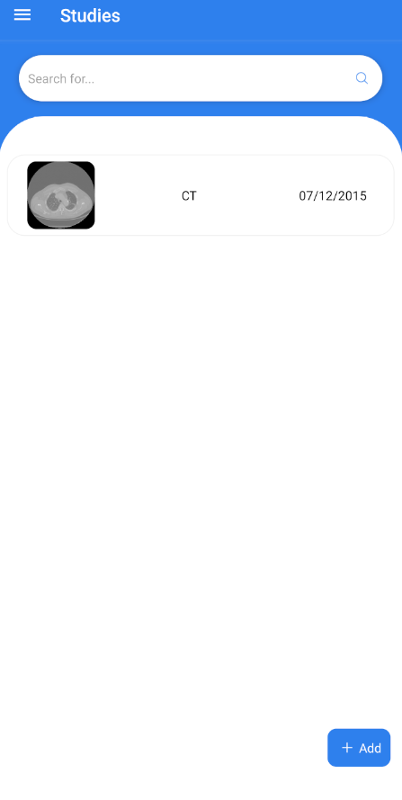

# Medical Image Viewer

The goal of this project is to simplify the interaction between the medic and the patient, such that the patient no longer has to receive a CD or a printed copy of the study.
The patient and the medics responsible have the possibility to chat on each study.

## Prereq

First, we need to create a couple of envs for this to work (as in the examples below):

Infra/.backend.env
```sh
db_pass='secure_miv'
db_user='miv'
db_name='miv'
db_host='db_auth'
# user and password for the email address
# used for sending the register link
email_user=''
email_pass=''
# where the backend server is located
backend_url='http://localhost:8000'
```

Infra/.db_auth.env
```sh
# same as the ones in .backend.env
MARIADB_PASSWORD = "secure_miv"
MARIADB_USER = "miv"
MARIADB_DATABASE = "miv"
MARIADB_ROOT_PASSWORD = "miv-root"
```

Infra/orthanc/.orthanc.env
```sh
ORTHANC__MYSQL__HOST = db_orthanc
ORTHANC__MYSQL__USERNAME = orthanc
ORTHANC__MYSQL__DATABASE = orthanc
ORTHANC__MYSQL__PASSWORD = orthanc_pass
ORTHANC__AUTHENTICATION_ENABLED = "false"
ORTHANC__STABLE_AGE = 10
VERBOSE_ENABLED = "false"
ORTHANC__CONCURRENT_JOBS = 0
ORTHANC__MAXIMUM_STORAGE_CACHE_SIZE = 4096
ORTHANC__DICOM_AET = "MIV"
ORTHANC__ORTHANC_EXPLORER_2__ENABLE="false"
ORTHANC__PYTHON__VERBOSE = "true"
ORTHANC__PYTHON__DISPLAY_MEMORY_USAGE = "false"
ORTHANC__PYTHON__PATH = "/etc/orthanc/python-scripts/check_permission.py"
AUTH_HOST="db_auth"
AUTH_DB="miv"
AUTH_USER="miv"
AUTH_PASS="secure_miv"
```

Infra/orthProxy/.orth_proxy.env
```sh
ORTHANC__AUTHENTICATION_ENABLED = "false"
VERBOSE_ENABLED = "false"
ORTHANC__CONCURRENT_JOBS = 0
ORTHANC__MAXIMUM_STORAGE_CACHE_SIZE = 4096
ORTHANC__DICOM_AET = "MIV_PROXY"
ORTHANC__ORTHANC_EXPLORER_2__ENABLE="false"
ORTHANC__PYTHON__PATH = "/etc/orthanc/python-scripts/sendToPeer.py"
PACS_URL="http://kong_gateway:8000"
USER_MIV = "proxrox"
# this is the mock password for the proxy user
PASS_MIV = "s3cur3p@ssw0rd"
```

## Start infra:
From root of project:

```sh
make run-infra
make upload-studies
```

## Start mobile:

```sh
make run-mobile
```

## Build mobile:

```sh
make build-mobile
```

## Mock Accounts

U: doctor1\
P: nu

U: doctor2\
P: nu

This one has a study\
U: patient1\
P: nu

U: patient2\
P: nu

U: mrAdmin\
P: nu


## What the app looks like


\


